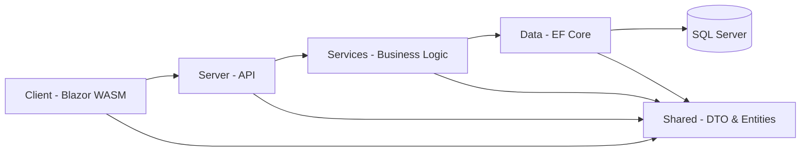
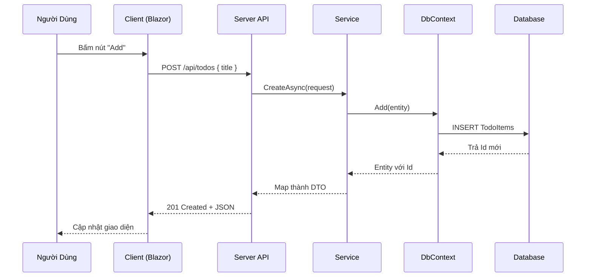
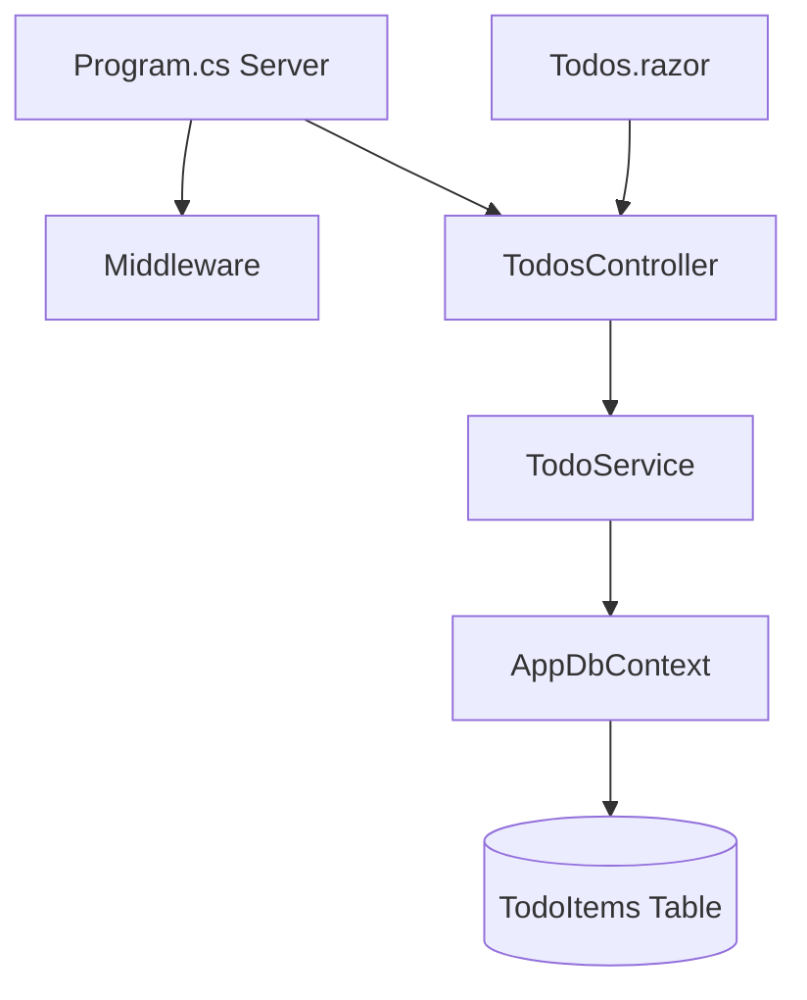

# Hướng Dẫn Cơ Bản & Chi Tiết Cho Project Blazor WebAssembly (Clean Architecture)

> Mục tiêu: Giúp người mới làm quen (sơ cấp) hiểu nhanh cấu trúc, kiến trúc, luồng hoạt động và cách viết code trong project này.
>
> Bạn chỉ cần biết C# cơ bản là có thể đọc hiểu tài liệu này.
> Nếu bị lỗi font tiếng Việt: đảm bảo file được lưu ở mã hóa UTF-8 (không chuyển sang ANSI). Trong VS Code: chọn UTF-8 ở góc phải thanh trạng thái.

---
## 1. Project Này Dùng Để Làm Gì?
Project là một ứng dụng Web gồm 2 phần:
- Client: Blazor WebAssembly (chạy trong trình duyệt, viết bằng C# thay vì JavaScript)
- Server: ASP.NET Core Web API (xử lý dữ liệu, truy vấn database)
- Database: SQL Server (lưu trữ thông tin thật sự)

Bạn mở website -> Trình duyệt tải phần Blazor -> Hiển thị giao diện -> Khi bạn thao tác (thêm Todo, xóa...) thì Client gửi HTTP request đến Server -> Server thao tác với Database -> Trả kết quả về.

---
## 2. Kiến Trúc Tổng Quan
### 2.1 Hình Ảnh Kiến Trúc
Nếu đã xuất sơ đồ thành file hình (PNG/SVG) đặt trong thư mục `Docs/Diagrams/` thì có thể nhúng như sau:

```md

```

(Đảm bảo tồn tại file `Docs/Diagrams/architecture.png` hoặc `architecture.svg`. Bạn có thể tạo hình từ file Mermaid bằng các cách ở dưới.)

### 2.2 Sơ đồ tầng (Layer) (Mermaid)
Dưới đây là sơ đồ Mermaid (tự động hiển thị nếu công cụ đọc Markdown hỗ trợ Mermaid). Nếu không hỗ trợ, dùng script chuyển đổi hoặc plugin.


#### Cách Xuất Sơ Đồ Thành Ảnh
1. Cài CLI: `npm install -g @mermaid-js/mermaid-cli`
2. Chạy: `mmdc -i Docs/Diagrams/architecture.mmd -o Docs/Diagrams/architecture.png`
3. Commit file ảnh để người xem GitHub thấy ngay.

- Client: Giao diện người dùng (.razor)
- Server: API nhận/gửi dữ liệu (Controllers)
- Services: Xử lý nghiệp vụ (logic như validate, chuyển đổi)
- Data: Làm việc với database (DbContext, Migration)
- Shared: Chứa các kiểu dùng chung (Entity + DTO)

### 2.3 Vì Sao Chia Tầng?
- Dễ bảo trì
- Dễ mở rộng: Thêm tính năng không ảnh hưởng mạnh các phần khác
- Test dễ hơn (mock tầng dưới)

---
## 2.4 Nhiệm Vụ Chi Tiết Từng Project (Solution Level)
| Project | Vai Trò | Chứa Gì | Không Nên Chứa |
|---------|---------|---------|----------------|
| Client | UI, routing, gọi API | `.razor` pages, layout, DI `HttpClient`, component tái sử dụng | Logic nghiệp vụ phức tạp, truy cập trực tiếp DB |
| Server | Cổng vào HTTP, cấu hình middleware, DI | `Program.cs`, Controllers, middleware custom | Business logic (nên ở Services), EF query trực tiếp lặp lại |
| Services | Business logic thuần, phối hợp Data + Shared | Interfaces (`ITodoService`), implementation (`TodoService`) | Code trình bày UI, HttpContext trực tiếp |
| Data | Truy cập dữ liệu, EF Core context, migrations | `AppDbContext`, cấu hình Fluent API, migrations | Logic nghiệp vụ (chuyển đổi DTO), validation cao cấp |
| Shared | Kiểu chia sẻ giữa Client/Server (DTO, Entity) | Entity map bảng, record DTO, enum, constants chung | DbContext, service implementation, controller |
| Components | (Tùy chọn) Các component UI tái sử dụng nếu tách ra | Component chung (Modal, Pagination, FormControls) | Logic truy cập API phức tạp (nên inject dịch vụ ở Client) |

### 2.4.1 Quy Tắc Di Chuyển Code Giữa Các Project
- Nếu code liên quan định nghĩa dữ liệu (Id, Name, CreatedAt) => Shared
- Nếu code thực thi truy vấn EF => Data (trong Service thì gọi DbContext, nhưng mapping cấu trúc DB vẫn ở Data/Shared)
- Nếu code chuyển đổi, validate domain => Services
- Nếu code hiển thị, bind state, sự kiện nút => Client
- Nếu code xử lý request pipeline chung (logging IP) => Server (Middleware)

### 2.4.2 Vòng Đời Một Request
```
Client (Pages) -> HttpClient -> Server (Controller) -> Services (Business Logic) -> Data (DbContext) -> SQL
                                    ^                              |
                                    |------- Shared DTO/Entity ----|
```

---
## 2.5 Ma Trận Quyết Định (Nhanh)
| Câu Hỏi | Đưa Vào | Lý Do |
|--------|---------|-------|
| "Thêm field mới cho Todo" | Shared (Entity + DTO), Data (Fluent config), Services (mapping) | Giữ đồng bộ tầng dữ liệu |
| "Thêm trang mới hiển thị danh sách" | Client (Page .razor) | UI routing |
| "Thêm logic kiểm tra trùng tên" | Services | Business rule |
| "Thêm index cho bảng" | Data (Migration) | Tối ưu DB |
| "Cache kết quả truy vấn" | Services (và dùng MemoryCache ở Server DI) | Gần logic trả về |

---
## 3. Cấu Trúc Thư Mục
```
BlazorAppStruct/
├─ Client/          # Ứng dụng Blazor WASM
│  ├─ Pages/        # Các trang (Home, Todos, Weather)
│  ├─ Layout/       # Layout + Menu
│  ├─ wwwroot/      # CSS/JS/images
│  ├─ Program.cs    # Khởi tạo app client
├─ Server/          # ASP.NET Core API
│  ├─ Controllers/  # REST Controllers
│  ├─ Middlewares/  # Custom middleware
│  ├─ Program.cs    # Khởi tạo app server
├─ Services/        # Business Logic
│  ├─ Interfaces/   # Định nghĩa interface
│  ├─ Implements/   # Triển khai service
├─ Data/            # Truy cập database
│  ├─ AppDbContext.cs
│  ├─ Migrations/
├─ Shared/          # Kiểu chung
│  ├─ Entities/Table/  # Entity (map bảng DB)
│  ├─ Entities/Dtos/   # DTO (trao đổi dữ liệu API)
├─ Components/      # (Nếu có) component tái sử dụng
├─ Docs/            # Tài liệu
```

---
## 3.1 Checklist Khi Thêm Mới Một Field Entity
1. Thêm thuộc tính vào Entity (Shared)
2. Thêm vào DTO nếu cần trả ra/nhận vào
3. Cập nhật Fluent API (Data/AppDbContext)
4. Tạo migration + update database
5. Cập nhật Service mapping
6. Cập nhật Controller (nếu thay đổi input/output)
7. Cập nhật UI hiển thị field

---
## 3.2 Thiết Kế Một Màn Hình Mới (Từng Bước)
Ví dụ: Màn hình quản lý "Tags" (gồm Id, Name, Color, CreatedAt)

### Bước 1: Xác Định Domain & Data
- Mục đích: Tag dùng để gắn vào Todo.
- Thuộc tính: Name (bắt buộc), Color (mã HEX), CreatedAt.

### Bước 2: Tạo Entity & DTO (Shared)
```csharp
// Shared/Entities/Table/Tag.cs
public class Tag
{
    public int Id { get; set; }
    public required string Name { get; set; }
    public string? Color { get; set; }
    public DateTime CreatedAt { get; set; } = DateTime.UtcNow;
}

// Shared/Entities/Dtos/TagDto.cs
public record TagDto(int Id, string Name, string? Color, DateTime CreatedAt);
public record CreateTagRequest(string Name, string? Color);
public record UpdateTagRequest(string Name, string? Color);
```

### Bước 3: Cập Nhật DbContext (Data)
```csharp
// Data/AppDbContext.cs
public DbSet<Tag> Tags => Set<Tag>();
protected override void OnModelCreating(ModelBuilder modelBuilder)
{
    base.OnModelCreating(modelBuilder);
    var tag = modelBuilder.Entity<Tag>();
    tag.ToTable("Tags");
    tag.HasKey(x => x.Id);
    tag.Property(x => x.Name).IsRequired().HasMaxLength(100);
    tag.Property(x => x.Color).HasMaxLength(20);
    tag.Property(x => x.CreatedAt).HasDefaultValueSql("GETUTCDATE()");
}
```

### Bước 4: Migration
```
cd Data
dotnet ef migrations add AddTagTable --startup-project ../Server
dotnet ef database update --startup-project ../Server
```

### Bước 5: Tạo Service Interface (Services)
```csharp
public interface ITagService
{
    Task<IReadOnlyList<TagDto>> GetAllAsync(CancellationToken ct = default);
    Task<TagDto?> GetByIdAsync(int id, CancellationToken ct = default);
    Task<TagDto> CreateAsync(CreateTagRequest req, CancellationToken ct = default);
    Task<TagDto?> UpdateAsync(int id, UpdateTagRequest req, CancellationToken ct = default);
    Task<bool> DeleteAsync(int id, CancellationToken ct = default);
}
```

### Bước 6: Implement Service
- Sử dụng LINQ `Select` để project sang DTO
- Validate Name không rỗng, Color đúng định dạng HEX (#RRGGBB) (có thể regex)

```csharp
public class TagService : ITagService
{
    private readonly AppDbContext _db;
    public TagService(AppDbContext db) => _db = db;

    public async Task<IReadOnlyList<TagDto>> GetAllAsync(CancellationToken ct)
        => await _db.Tags.OrderBy(x => x.Name)
            .Select(x => new TagDto(x.Id, x.Name, x.Color, x.CreatedAt))
            .ToListAsync(ct);

    public async Task<TagDto?> GetByIdAsync(int id, CancellationToken ct)
        => await _db.Tags.Where(x => x.Id == id)
            .Select(x => new TagDto(x.Id, x.Name, x.Color, x.CreatedAt))
            .FirstOrDefaultAsync(ct);

    public async Task<TagDto> CreateAsync(CreateTagRequest req, CancellationToken ct)
    {
        var entity = new Tag { Name = req.Name.Trim(), Color = req.Color?.Trim() };
        _db.Tags.Add(entity);
        await _db.SaveChangesAsync(ct);
        return new TagDto(entity.Id, entity.Name, entity.Color, entity.CreatedAt);
    }

    public async Task<TagDto?> UpdateAsync(int id, UpdateTagRequest req, CancellationToken ct)
    {
        var entity = await _db.Tags.FirstOrDefaultAsync(x => x.Id == id, ct);
        if (entity is null) return null;
        entity.Name = req.Name.Trim();
        entity.Color = req.Color?.Trim();
        await _db.SaveChangesAsync(ct);
        return new TagDto(entity.Id, entity.Name, entity.Color, entity.CreatedAt);
    }

    public async Task<bool> DeleteAsync(int id, CancellationToken ct)
    {
        var entity = await _db.Tags.FirstOrDefaultAsync(x => x.Id == id, ct);
        if (entity is null) return false;
        _db.Tags.Remove(entity);
        await _db.SaveChangesAsync(ct);
        return true;
    }
}
```

### Bước 7: Đăng Ký DI (Server/Program.cs)
```csharp
builder.Services.AddScoped<ITagService, TagService>();
```

### Bước 8: Tạo Controller
```csharp
[ApiController]
[Route("api/[controller]")]
public class TagsController : ControllerBase
{
    private readonly ITagService _service;
    public TagsController(ITagService service) => _service = service;

    [HttpGet]
    public async Task<IReadOnlyList<TagDto>> GetAll(CancellationToken ct) => await _service.GetAllAsync(ct);

    [HttpGet("{id:int}")]
    public async Task<ActionResult<TagDto>> GetById(int id, CancellationToken ct)
    {
        var item = await _service.GetByIdAsync(id, ct);
        return item is null ? NotFound() : Ok(item);
    }

    [HttpPost]
    public async Task<ActionResult<TagDto>> Create(CreateTagRequest req, CancellationToken ct)
    {
        if (string.IsNullOrWhiteSpace(req.Name)) return BadRequest("Name required");
        var created = await _service.CreateAsync(req, ct);
        return CreatedAtAction(nameof(GetById), new { id = created.Id }, created);
    }

    [HttpPut("{id:int}")]
    public async Task<ActionResult<TagDto>> Update(int id, UpdateTagRequest req, CancellationToken ct)
    {
        var updated = await _service.UpdateAsync(id, req, ct);
        return updated is null ? NotFound() : Ok(updated);
    }

    [HttpDelete("{id:int}")]
    public async Task<IActionResult> Delete(int id, CancellationToken ct)
    {
        var ok = await _service.DeleteAsync(id, ct);
        return ok ? NoContent() : NotFound();
    }
}
```

### Bước 9: Tạo Page UI (Client/Pages/Tags.razor)
```razor
@page "/tags"
@inject HttpClient Http
@using Shared.Entities.Dtos

<h3>Tags</h3>
<div class="mb-3">
    <input class="form-control" @bind="formName" placeholder="Tag name" />
    <input class="form-control mt-2" @bind="formColor" placeholder="#RRGGBB" />
    <button class="btn btn-primary mt-2" @onclick="SaveAsync" disabled="@string.IsNullOrWhiteSpace(formName)">@(editingId.HasValue ? "Update" : "Add")</button>
    @if (editingId.HasValue)
    {
        <button class="btn btn-secondary mt-2 ms-2" @onclick="CancelEdit">Cancel</button>
    }
</div>

@if (loading)
{
    <p>Loading...</p>
}
else if (tags.Count == 0)
{
    <div>No tags yet.</div>
}
else
{
    <table class="table table-sm">
        <thead><tr><th>Name</th><th>Color</th><th>Created</th><th></th></tr></thead>
        <tbody>
        @foreach (var t in tags)
        {
            <tr>
                <td>@t.Name</td>
                <td><span style="display:inline-block;width:16px;height:16px;background:@t.Color;"></span> @t.Color</td>
                <td>@t.CreatedAt.ToShortDateString()</td>
                <td>
                    <button class="btn btn-sm btn-outline-primary" @onclick="() => Edit(t)">Edit</button>
                    <button class="btn btn-sm btn-outline-danger" @onclick="() => DeleteAsync(t.Id)">Delete</button>
                </td>
            </tr>
        }
        </tbody>
    </table>
}

@code {
    private List<TagDto> tags = new();
    private string? formName;
    private string? formColor;
    private int? editingId;
    private bool loading;

    protected override async Task OnInitializedAsync() => await LoadAsync();

    private async Task LoadAsync()
    {
        loading = true;
        try
        {
            tags = await Http.GetFromJsonAsync<List<TagDto>>("api/tags") ?? [];
        }
        finally { loading = false; }
    }

    private async Task SaveAsync()
    {
        if (string.IsNullOrWhiteSpace(formName)) return;
        if (editingId.HasValue)
        {
            var req = new UpdateTagRequest(formName!, formColor);
            var res = await Http.PutAsJsonAsync($"api/tags/{editingId}", req);
            if (res.IsSuccessStatusCode) { await LoadAsync(); CancelEdit(); }
        }
        else
        {
            var req = new CreateTagRequest(formName!, formColor);
            var res = await Http.PostAsJsonAsync("api/tags", req);
            if (res.IsSuccessStatusCode) { await LoadAsync(); formName = formColor = string.Empty; }
        }
    }

    private void Edit(TagDto t)
    {
        editingId = t.Id; formName = t.Name; formColor = t.Color;
    }
    private void CancelEdit() { editingId = null; formName = formColor = string.Empty; }

    private async Task DeleteAsync(int id)
    {
        var res = await Http.DeleteAsync($"api/tags/{id}");
        if (res.IsSuccessStatusCode)
        {
            tags.RemoveAll(x => x.Id == id);
        }
    }
}
```

### Bước 10: Thêm Vào Navigation (Client/Layout/NavMenu.razor)
```razor
<div class="nav-item px-3">
  <NavLink class="nav-link" href="tags">Tags</NavLink>
</div>
```

### Bước 11: Kiểm Tra Chéo
| Kiểm Tra | Đã Làm? |
|----------|---------|
| Entity & DTO tạo đúng tên | ✓ |
| DbContext có DbSet + Fluent API | ✓ |
| Migration chạy thành công | ✓ |
| Service đăng ký DI | ✓ |
| Controller route `api/tags` hoạt động | ✓ |
| UI gọi đúng endpoint | ✓ |
| Navigation hiển thị link mới | ✓ |
| Swagger hiển thị endpoints mới | ✓ |

### Bước 12: Những Sai Lầm Thường Gặp
| Sai Lầm | Hậu Quả | Cách Sửa |
|---------|---------|----------|
| Quên thêm DbSet | Runtime query lỗi | Thêm `public DbSet<Tag> Tags` |
| Quên migration update | Không có bảng trong DB | Chạy lệnh update database |
| Return Entity trực tiếp | Lộ toàn bộ cấu trúc | Dùng DTO trong Select |
| Chưa đăng ký DI service | 500 lỗi Resolve | `builder.Services.AddScoped<ITagService, TagService>();` |
| Nhầm route (thiếu `api/`) | 404 | Đảm bảo `[Route("api/[controller]")]` |
| Không reset form sau Create | UX kém | Xóa biến form sau thành công |

---
## 3.3 Mẫu Template Tạo Màn Hình Nhanh
```
1. Shared: Entity + DTO
2. Data: DbSet + Fluent config + Migration
3. Services: Interface + Implementation
4. Server: Đăng ký DI + Controller
5. Client: Page .razor + gọi API + Navigation
6. Test: Swagger -> UI
```

---
## 4. Luồng Hoạt Động (Ví dụ: Thêm Todo)


### Các Bước Chi Tiết
1. Người dùng bấm nút
2. Component gọi hàm AddAsync()
3. Gửi HTTP POST đến API
4. Controller nhận, kiểm tra dữ liệu
5. Gọi Service xử lý nghiệp vụ
6. Service tạo Entity -> DbContext lưu vào DB
7. Trả DTO về Controller
8. Controller trả JSON về Client
9. Client cập nhật danh sách

---
## 5. Các Khái Niệm Quan Trọng

### 5.1 Entity vs DTO

| Loại   | Dùng Ở Đâu   | Mục Đích                 |
| ------ | ------------ | ------------------------ |
| Entity | Data Layer   | Map bảng trong DB        |
| DTO    | API + Client | Trao đổi dữ liệu an toàn |

Không gửi Entity trực tiếp cho Client để tránh lộ nội bộ / thay đổi khó.

### 5.2 Service

- Chứa logic: chuẩn hóa dữ liệu, map DTO, truy vấn
- Controller chỉ đóng vai trò điều phối (mỏng)

### 5.3 Middleware

- Chạy giữa lúc nhận request và trước khi đến Controller
- Ví dụ lấy IP, logging, xác thực

---

## 6. Ví Dụ Mã Quan Trọng

### 6.1 Component Todos.razor (rút gọn)

```razor
@page "/todos"
@inject HttpClient Http
@using Shared.Entities.Dtos

<input @bind="newTitle" placeholder="New todo..." />
<button @onclick="AddAsync">Add</button>

@code {
  private List<TodoItemDto> todos = new();
  private string? newTitle;

  protected override async Task OnInitializedAsync() => await LoadAsync();

  private async Task LoadAsync() =>
      todos = await Http.GetFromJsonAsync<List<TodoItemDto>>("api/todos") ?? [];

  private async Task AddAsync()
  {
    if (string.IsNullOrWhiteSpace(newTitle)) return;
    var res = await Http.PostAsJsonAsync("api/todos", new CreateTodoRequest(newTitle));
    if (res.IsSuccessStatusCode)
    {
      var created = await res.Content.ReadFromJsonAsync<TodoItemDto>();
      if (created != null) todos.Insert(0, created);
      newTitle = string.Empty;
    }
  }
}
```

### 6.2 Controller

```csharp
[ApiController]
[Route("api/[controller]")]
public class TodosController : ControllerBase
{
    private readonly ITodoService _service;
    public TodosController(ITodoService service) => _service = service;

    [HttpPost]
    public async Task<ActionResult<TodoItemDto>> Create(CreateTodoRequest req, CancellationToken ct)
    {
        if (string.IsNullOrWhiteSpace(req.Title)) return BadRequest("Title required");
        var created = await _service.CreateAsync(req, ct);
        return CreatedAtAction(nameof(GetById), new { id = created.Id }, created);
    }

    [HttpGet]
    public async Task<IReadOnlyList<TodoItemDto>> GetAll(CancellationToken ct) =>
        await _service.GetAllAsync(ct);

    [HttpGet("{id:int}")]
    public async Task<ActionResult<TodoItemDto>> GetById(int id, CancellationToken ct)
    {
        var item = await _service.GetByIdAsync(id, ct);
        return item is null ? NotFound() : Ok(item);
    }
}
```

### 6.3 Service

```csharp
public class TodoService : ITodoService
{
  private readonly AppDbContext _db;
  public TodoService(AppDbContext db) => _db = db;

  public async Task<TodoItemDto> CreateAsync(CreateTodoRequest r, CancellationToken ct)
  {
    var entity = new TodoItem { Title = r.Title.Trim(), IsDone = false, CreatedAt = DateTime.UtcNow };
    _db.TodoItems.Add(entity);
    await _db.SaveChangesAsync(ct);
    return new(entity.Id, entity.Title, entity.IsDone, entity.CreatedAt);
  }

  public async Task<IReadOnlyList<TodoItemDto>> GetAllAsync(CancellationToken ct) =>
    await _db.TodoItems
      .OrderByDescending(x => x.CreatedAt)
      .Select(x => new TodoItemDto(x.Id, x.Title, x.IsDone, x.CreatedAt))
      .ToListAsync(ct);

  public async Task<TodoItemDto?> GetByIdAsync(int id, CancellationToken ct) =>
    await _db.TodoItems.Where(x => x.Id == id)
      .Select(x => new TodoItemDto(x.Id, x.Title, x.IsDone, x.CreatedAt))
      .FirstOrDefaultAsync(ct);

  public async Task<TodoItemDto?> UpdateAsync(int id, UpdateTodoRequest r, CancellationToken ct)
  {
    var entity = await _db.TodoItems.FirstOrDefaultAsync(x => x.Id == id, ct);
    if (entity is null) return null;
    entity.Title = r.Title.Trim();
    entity.IsDone = r.IsDone;
    await _db.SaveChangesAsync(ct);
    return new(entity.Id, entity.Title, entity.IsDone, entity.CreatedAt);
  }

  public async Task<bool> DeleteAsync(int id, CancellationToken ct)
  {
    var entity = await _db.TodoItems.FirstOrDefaultAsync(x => x.Id == id, ct);
    if (entity is null) return false;
    _db.TodoItems.Remove(entity);
    await _db.SaveChangesAsync(ct);
    return true;
  }
}
```

### 6.4 Entity & DTO

```csharp
public class TodoItem
{
  public int Id { get; set; }
  public required string Title { get; set; }
  public bool IsDone { get; set; }
  public DateTime CreatedAt { get; set; } = DateTime.UtcNow;
}

public record TodoItemDto(int Id, string Title, bool IsDone, DateTime CreatedAt);
public record CreateTodoRequest(string Title);
public record UpdateTodoRequest(string Title, bool IsDone);
```

---

## 7. Thêm Một Tính Năng Mới (Checklist)
Ví dụ muốn thêm Product:

1. Tạo Entity: Shared/Entities/Table/Product.cs
2. Tạo DTOs: Shared/Entities/Dtos/ProductDto.cs
3. Thêm DbSet + cấu hình vào AppDbContext
4. Tạo Migration + cập nhật DB:
   - `dotnet ef migrations add AddProduct --startup-project ../Server`
   - `dotnet ef database update --startup-project ../Server`
5. Tạo Interface: `IProductService`
6. Implement Service: `ProductService`
7. Đăng ký DI trong Server/Program.cs
8. Tạo Controller: `ProductsController`
9. Tạo Razor Page: `Products.razor`
10. Thêm vào menu điều hướng

---

## 8. Các Quy Tắc Code Cơ Bản
- Class/Method: PascalCase (TodoService, CreateAsync)
- Interface: Bắt đầu bằng chữ I (ITodoService)
- Biến local / field private: camelCase / \_camelCase
- Async method kết thúc bằng Async
- Không viết logic vào Controller quá nhiều

---

## 9. Best Practices Đơn Giản
| Tình Huống        | Nên                        | Tránh                          |
| ----------------- | -------------------------- | ------------------------------ |
| Đọc dữ liệu       | Dùng LINQ + Select vào DTO | Trả Entity trực tiếp           |
| Query nhiều lần   | Tách thành service         | Code dàn trải trong Controller |
| Xử lý bất đồng bộ | async/await                | `.Result` hoặc `.Wait()`       |
| Validate input    | Kiểm tra null/rỗng         | Tin vào dữ liệu người dùng     |
| Thêm tính năng    | Tuân thủ checklist         | Chèn thẳng vào mọi nơi         |

---

## 10. Debug Nhanh
- Lỗi kết nối DB: kiểm tra `ConnectionStrings` trong appsettings.json
- API 404: Sai route (ví dụ thiếu `api/`)
- UI không cập nhật: Quên gọi `StateHasChanged()` (trường hợp nâng cao) hoặc quên gán danh sách mới
- Request lỗi CORS: Với Blazor WASM Hosted phải bật cấu hình CORS nếu tách domain

---

## 11. Bảo Mật Cơ Bản
- Luôn dùng HTTPS trong production
- Không log thông tin nhạy cảm (mật khẩu, token)
- Không expose Entity thẳng ra ngoài
- Thêm Authentication/Authorization (nâng cao sau)

---

## 12. Sơ Đồ Quan Hệ File Chính


---

## 13. Các Thuật Ngữ
| Thuật Ngữ   | Giải Thích Ngắn                          |
| ----------- | ---------------------------------------- |
| Blazor WASM | Chạy C# trên trình duyệt qua WebAssembly |
| HTTP API    | Giao tiếp giữa Client & Server bằng HTTP |
| DTO         | Gói dữ liệu gửi/nhận                     |
| Entity      | Đại diện bảng trong DB                   |
| Service     | Chứa nghiệp vụ (Business Logic)          |
| Middleware  | Xử lý giữa pipeline request              |
| DbContext   | Cầu nối EF Core -> Database              |
| Migration   | Tập tin mô tả thay đổi cấu trúc DB       |

---

## 14. Gợi Ý Học Tiếp
- Thêm xác thực (Identity / JWT)
- Pagination (chia trang cho danh sách lớn)
- Logging & Monitoring (Serilog / OpenTelemetry)
- Unit Test (xUnit + Moq)

---

## 15. Tóm Tắt Nhanh
1. Blazor hiển thị giao diện, gọi API bằng HttpClient
2. API nhận request, Controller chuyển cho Service
3. Service tương tác DbContext, truy vấn/ghi dữ liệu
4. Dùng DTO để trả về dữ liệu an toàn
5. Tách tầng giúp bảo trì dễ và mở rộng nhanh

---

## 16. Mẫu Checklist Khi Commit
- [ ] Entity + DTO đầy đủ
- [ ] Service có interface
- [ ] Controller nhỏ gọn
- [ ] Không return Entity trực tiếp
- [ ] Query dùng Select vào DTO
- [ ] Đã test API qua Swagger
- [ ] UI hiển thị đúng

---

## 17. Hỏi Đáp Nhanh
| Câu Hỏi                        | Trả Lời                                           |
| ------------------------------ | ------------------------------------------------- |
| Tại sao không dùng JavaScript? | Blazor cho phép dùng C# toàn bộ.                  |
| Có cần backend không?          | Có, để lưu dữ liệu thật (API + DB).               |
| DTO khác gì Entity?            | DTO chỉ là gói dữ liệu, Entity map trực tiếp DB.  |
| Có thể bỏ Service không?       | Không khuyến khích, sẽ trộn logic vào Controller. |

---

## 18. Tài Nguyên Tham Khảo
- https://learn.microsoft.com/aspnet/core/blazor/
- https://learn.microsoft.com/ef/core/
- https://learn.microsoft.com/aspnet/core/web-api/

---

**Phiên bản tài liệu:** 1.2
**Cập nhật cuối:** 2025-11-14
**Tác giả:** AI Assistant

> Hãy đọc chậm, thực hành từng phần. Thử chỉnh Todos trước khi thêm tính năng mới.
